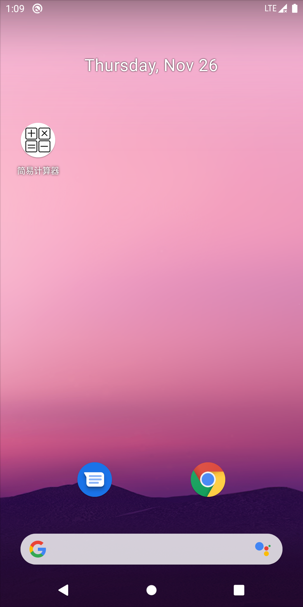
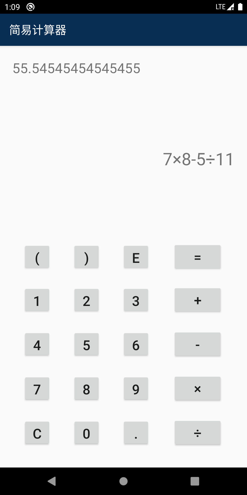

# Simple Calculator
---

## Preview

 

## Why Developed It?

As a matter of fact, I just developed it for fun. Actually, there are too many calculators in app stores, and it is meaningless to compete with them.

Moreover, there are some bugs causing the app crashed I haven't fixed yet, that's impossible to release it as a normal product.

So what makes it interesting? I think it should be the usage of stacks. Usually, people use infix expressions like `2 + 2 = 4` in daily life, but computers don't understand them. If somebody wants computers dealing with these expressions, the first thing is to convert them into other forms, such as postfix expressions like `2 2 +`.

When dealing with postfix expressions, computers will push numbers into a stack until they meet operators, then pop two numbers out, and calculate the result -- a number, then push it into the stack until meeting the next operator. 

If everything goes right, there is supposed to be only a number in the stack, no more numbers and operators can be pushed in, then just pop it out as the final result.